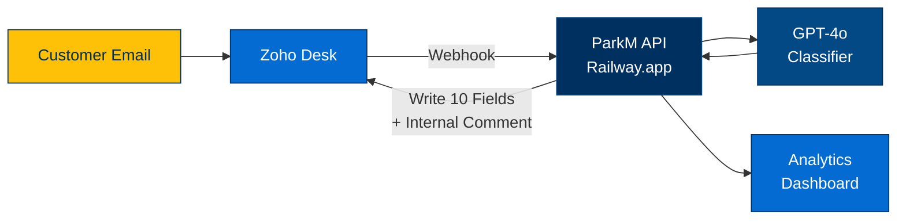
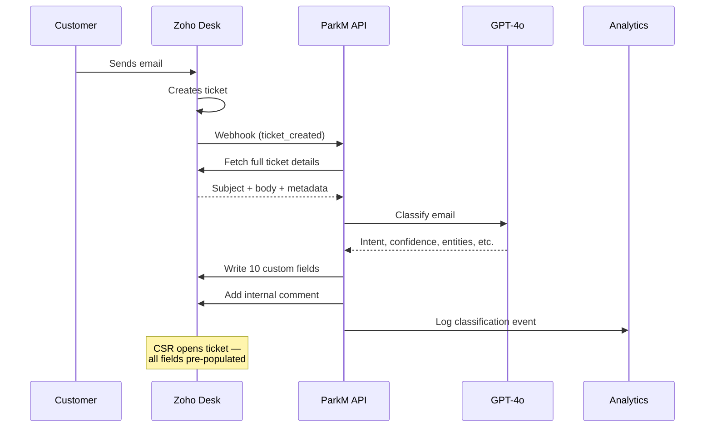
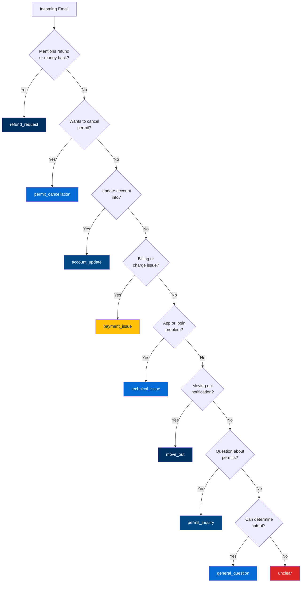
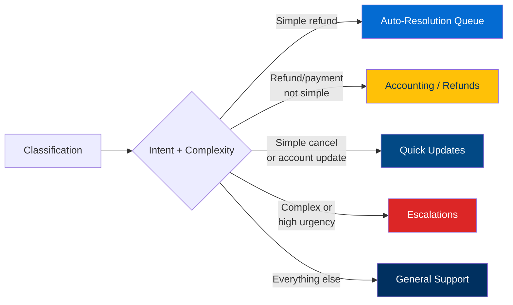
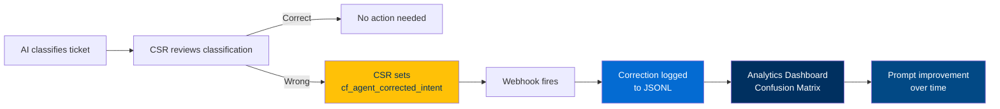
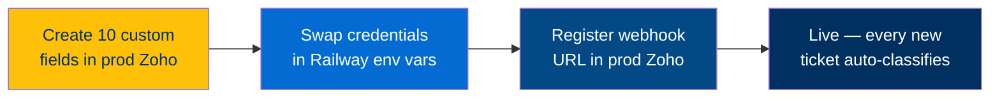

# P1: AI Email Classification

## The Problem

CSRs manually read every incoming Zoho Desk ticket, figure out what the customer wants, and route it. This is slow, inconsistent, and doesn't scale.

## The Solution

An AI classifier that **automatically reads every incoming ticket, categorizes it, extracts key info, and writes it back to Zoho** — all in ~5 seconds, before a CSR even opens it.

---

## System Architecture

## End-to-End Flow

## What the AI Classifies (10 fields per ticket)

| Field | Type | Values |
|-------|------|--------|
| **Intent** | Dropdown | refund_request, permit_cancellation, account_update, permit_inquiry, payment_issue, technical_issue, move_out, general_question, unclear |
| **Complexity** | Dropdown | simple, moderate, complex |
| **Language** | Dropdown | english, spanish, mixed, other |
| **Urgency** | Dropdown | high, medium, low |
| **Confidence** | Number | 0-100% (calibrated with mandatory deductions) |
| **Requires Refund** | Boolean | Yes / No |
| **Requires Human Review** | Boolean | Yes / No |
| **License Plate** | Text | Extracted from email body |
| **Move-Out Date** | Date | Parsed to YYYY-MM-DD |
| **Routing Queue** | Text | Suggested department (see below) |

## Intent Classification Logic

## Confidence Calibration

The AI doesn't just say "95% confident" on everything. We enforce strict scoring:

| Score Range | Meaning | Rule |
|-------------|---------|------|
| **90-100%** | Crystal clear intent + all key entities present | Very few emails qualify |
| **75-89%** | Clear intent, missing some entities | No plate, no date, no amount |
| **60-74%** | Ambiguous — could be multiple intents | Vague language, conflicting signals |
| **40-59%** | Very unclear, short, contradictory | Subject-only emails cap at 55% |
| **Below 40%** | Cannot determine intent | Gibberish, empty, off-topic |

**Mandatory deductions:**
- Empty body (subject only) → max 55%
- Forwarded/reply chain noise → -10%
- Multiple possible intents → max 70%
- Missing license plate → -5%
- Missing move-out date → -5%

## Routing Recommendation

> **Note:** This is a recommendation label only — no tickets are moved automatically today. The `move_to_department()` API method exists and is ready to wire up, but actual auto-routing needs Katie's input on department structure and whether tickets should move without CSR review. This is a natural Phase 2 enhancement once classification accuracy is validated in production.

## Correction Feedback Loop

## Current Stats (Sandbox)

- **94 tickets classified**, 0 errors
- **80% avg confidence** (calibrated, not inflated)
- **~5s avg processing time** per ticket
- **100% tagging success** — every classification written back to Zoho
- **Live webhook** — new tickets auto-classify within seconds

## What's Live Right Now

| Component | Status | URL |
|-----------|--------|-----|
| ParkM API | Healthy | `parkm-production.up.railway.app` |
| Zoho Sandbox | Connected | Org: 856336669 |
| Webhook | Active | Auto-classifies on ticket creation |
| Analytics Dashboard | Live | `parkm-production.up.railway.app/analytics/dashboard` |

## Demo Flow

1. Create a new ticket in the sandbox (any subject/body)
2. Wait ~5 seconds
3. Open the ticket — all 10 custom fields populated + internal comment
4. Show the analytics dashboard updating in real-time

## Production Rollout Steps

1. Create the same 10 custom fields in production Zoho Desk
2. Swap sandbox credentials for production org in Railway env vars
3. Register the webhook URL in Zoho Desk production
4. Live — every new ticket auto-classifies
